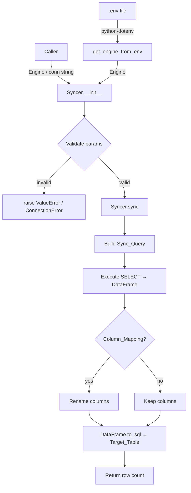

# Design Document: db-table-sync

## Overview

`db-table-sync` es un módulo Python que sincroniza tablas entre bases de datos de distintos proveedores (MySQL, PostgreSQL, SQLite, etc.). Orquesta tres responsabilidades bien delimitadas:

1. **Extracción**: ejecuta una `SELECT` configurable sobre la base de datos origen usando SQLAlchemy.
2. **Transformación**: carga el resultado en un DataFrame de Pandas y aplica el mapeo de columnas.
3. **Carga**: inserta el DataFrame en la tabla destino usando `DataFrame.to_sql`.

El módulo expone una clase principal `Syncer` y una función auxiliar `get_engine_from_env`. La configuración de credenciales se gestiona con `python-dotenv`, manteniendo las cadenas de conexión fuera del código fuente.

---

## Architecture



El flujo es lineal y sin estado persistente entre llamadas: cada invocación de `sync()` es independiente.

---

## Components and Interfaces

### `Syncer` (clase principal)

```python
class Syncer:
    def __init__(
        self,
        source: Engine | str,
        target: Engine | str,
        source_table: str,
        column_list: list[str],
        target_table: str | None = None,
        column_mapping: dict[str, str] | None = None,
        if_exists: Literal["append", "replace", "fail"] = "append",
    ) -> None: ...

    def sync(self) -> int:
        """Ejecuta la sincronización y retorna el número de filas sincronizadas."""
        ...
```

**Responsabilidades de `__init__`:**
- Validar que `column_list` no esté vacío.
- Validar que `if_exists` sea uno de los valores permitidos.
- Validar que todas las claves de `column_mapping` existan en `column_list`.
- Crear engines SQLAlchemy si se reciben cadenas de conexión.
- Verificar conectividad (ping) de ambas conexiones.

**Responsabilidades de `sync`:**
- Construir y ejecutar la `Sync_Query`.
- Cargar resultados en un DataFrame.
- Aplicar `column_mapping` si existe.
- Insertar con `DataFrame.to_sql`.
- Emitir logs en cada etapa.
- Capturar excepciones y re-lanzar como `RuntimeError`.

---

### `get_engine_from_env` (función auxiliar)

```python
def get_engine_from_env(var_name: str) -> Engine:
    """
    Lee la variable de entorno `var_name` y retorna un SQLAlchemy Engine.
    Carga automáticamente el .env del directorio de trabajo.
    Lanza KeyError si la variable no está definida.
    """
    ...
```

---

### Módulo `db_table_sync`

Estructura de archivos propuesta:

```
db_table_sync/
├── __init__.py          # exporta Syncer y get_engine_from_env
├── syncer.py            # clase Syncer
└── env_helper.py        # get_engine_from_env
```

---

## Data Models

### Parámetros de entrada (`Syncer.__init__`)

| Parámetro        | Tipo                              | Requerido | Default    | Descripción                                      |
|------------------|-----------------------------------|-----------|------------|--------------------------------------------------|
| `source`         | `Engine \| str`                   | Sí        | —          | Conexión o cadena de conexión origen             |
| `target`         | `Engine \| str`                   | Sí        | —          | Conexión o cadena de conexión destino            |
| `source_table`   | `str`                             | Sí        | —          | Nombre de la tabla origen                        |
| `column_list`    | `list[str]`                       | Sí        | —          | Columnas a sincronizar (mínimo 1)                |
| `target_table`   | `str \| None`                     | No        | `None`     | Nombre tabla destino; si None usa `source_table` |
| `column_mapping` | `dict[str, str] \| None`          | No        | `None`     | Mapeo `{col_origen: col_destino}`                |
| `if_exists`      | `"append" \| "replace" \| "fail"` | No        | `"append"` | Estrategia de inserción                          |

### Valor de retorno de `sync()`

`int` — número de filas insertadas en la tabla destino.

### Sync_Query generada

```sql
SELECT col1, col2, ..., colN FROM {source_table}
```

La query se construye con parámetros seguros usando `sqlalchemy.text` y la lista de columnas validada.

---

## Correctness Properties

*A property is a characteristic or behavior that should hold true across all valid executions of a system — essentially, a formal statement about what the system should do. Properties serve as the bridge between human-readable specifications and machine-verifiable correctness guarantees.*

### Property 1: Cadenas de conexión producen engines válidos

*For any* cadena de conexión válida pasada como `source` o `target`, el `Syncer` debe inicializarse sin error y los atributos internos deben ser instancias de `sqlalchemy.engine.Engine`.

**Validates: Requirements 1.1, 1.2**

---

### Property 2: Conexiones inválidas lanzan ConnectionError

*For any* cadena de conexión inválida (host inexistente, credenciales incorrectas) pasada como `source` o `target`, el `Syncer` debe lanzar un `ConnectionError` con un mensaje descriptivo que indique cuál conexión falló.

**Validates: Requirements 1.3, 1.4**

---

### Property 3: Resolución de target_table

*For any* valor de `source_table`, si `target_table` no se especifica el `Syncer` debe usar `source_table` como nombre de tabla destino; si `target_table` se especifica explícitamente, debe usar ese valor.

**Validates: Requirements 2.2, 2.3**

---

### Property 4: Sync_Query generada correctamente

*For any* lista no vacía de columnas `column_list` y cualquier nombre de tabla `source_table`, la `Sync_Query` generada debe contener exactamente esas columnas y ese nombre de tabla en la forma `SELECT col1, col2, ... FROM source_table`.

**Validates: Requirements 3.2**

---

### Property 5: Column_List vacía lanza ValueError

*For any* intento de construir un `Syncer` con `column_list` vacía o no provista, debe lanzarse un `ValueError` con un mensaje descriptivo.

**Validates: Requirements 3.1, 3.3**

---

### Property 6: Mapeo de columnas aplicado correctamente

*For any* `column_mapping` válido (todas las claves existen en `column_list`), después de ejecutar `sync()` las columnas insertadas en la tabla destino deben corresponder a los valores del mapping (nombres destino), no a los nombres origen.

**Validates: Requirements 4.1, 4.2, 4.4**

---

### Property 7: Clave de mapeo inexistente lanza ValueError

*For any* `column_mapping` que contenga una clave que no existe en `column_list`, el `Syncer` debe lanzar un `ValueError` indicando el nombre de columna problemático.

**Validates: Requirements 4.3**

---

### Property 8: Round-trip de sincronización

*For any* tabla origen con N filas (N ≥ 0), después de llamar a `sync()` la tabla destino debe contener exactamente esas N filas con los valores correctos, y `sync()` debe retornar el entero N.

**Validates: Requirements 5.1, 5.2, 5.3**

---

### Property 9: Errores de ejecución lanzan RuntimeError

*For any* error que ocurra durante la ejecución de la query o la inserción (tabla inexistente, error de red, etc.), `sync()` debe lanzar un `RuntimeError` que preserve el contexto de la excepción original.

**Validates: Requirements 5.4, 5.5**

---

### Property 10: Validación de if_exists

*For any* valor de `if_exists` que sea `"append"`, `"replace"` o `"fail"`, el `Syncer` debe inicializarse sin error. *For any* valor que no sea uno de esos tres, debe lanzarse un `ValueError` que liste los valores permitidos. Cuando no se especifica, el valor efectivo debe ser `"append"`.

**Validates: Requirements 6.1, 6.2, 6.3**

---

### Property 11: get_engine_from_env retorna Engine válido

*For any* nombre de variable de entorno que contenga una cadena de conexión válida, `get_engine_from_env(var_name)` debe retornar una instancia de `sqlalchemy.engine.Engine`.

**Validates: Requirements 7.1, 7.2, 7.3**

---

### Property 12: Variable de entorno ausente lanza KeyError

*For any* nombre de variable de entorno que no esté definida, `get_engine_from_env(var_name)` debe lanzar un `KeyError` con un mensaje que incluya el nombre de la variable.

**Validates: Requirements 7.4**

---

### Property 13: Logs emitidos en cada etapa del sync

*For any* ejecución exitosa de `sync()`, deben emitirse al menos tres mensajes de nivel INFO: uno antes de ejecutar la query (con nombre de tabla y número de columnas), uno al cargar el DataFrame (con número de filas), y uno al completar la inserción (con número de filas y nombre de tabla destino). Ante cualquier error, debe emitirse al menos un mensaje de nivel ERROR antes de re-lanzar la excepción.

**Validates: Requirements 8.1, 8.2, 8.3, 8.4**

---

## Error Handling

| Situación | Excepción | Cuándo se lanza |
|-----------|-----------|-----------------|
| Conexión origen inválida | `ConnectionError` | En `__init__` al verificar conectividad |
| Conexión destino inválida | `ConnectionError` | En `__init__` al verificar conectividad |
| `column_list` vacía | `ValueError` | En `__init__` |
| Clave de `column_mapping` no en `column_list` | `ValueError` | En `__init__` |
| `if_exists` con valor no permitido | `ValueError` | En `__init__` |
| Error al ejecutar la Sync_Query | `RuntimeError` (con `__cause__`) | En `sync()` |
| Error al insertar en tabla destino | `RuntimeError` (con `__cause__`) | En `sync()` |
| Variable de entorno no definida | `KeyError` | En `get_engine_from_env()` |

Todas las excepciones de `sync()` preservan el contexto original usando `raise RuntimeError(...) from original_exc`.

Los errores se loguean a nivel ERROR antes de re-lanzar, usando el logger del módulo (`logging.getLogger(__name__)`).

---

## Testing Strategy

### Enfoque dual: unit tests + property-based tests

Ambos tipos son complementarios y necesarios:

- **Unit tests**: verifican ejemplos concretos, casos borde y condiciones de error.
- **Property tests**: verifican propiedades universales sobre rangos amplios de entradas generadas aleatoriamente.

### Librería de property-based testing

Se usará **[Hypothesis](https://hypothesis.readthedocs.io/)** (Python), configurada con un mínimo de 100 iteraciones por propiedad (`settings(max_examples=100)`).

### Unit tests (pytest)

Cubren:
- Inicialización correcta con Engine y con connection string.
- Valor por defecto de `target_table` y `if_exists`.
- Lanzamiento de `ValueError` con `column_list` vacía.
- Lanzamiento de `ValueError` con clave de `column_mapping` inválida.
- Lanzamiento de `ValueError` con `if_exists` inválido.
- `get_engine_from_env` con variable presente y ausente.
- Sync end-to-end con SQLite en memoria (origen y destino).
- Sync con `column_mapping` aplicado.
- Sync con `if_exists="replace"` y `"fail"`.
- Lanzamiento de `RuntimeError` ante tabla origen inexistente.

### Property tests (Hypothesis)

Cada test referencia la propiedad del diseño con el tag:
`# Feature: db-table-sync, Property N: <texto>`

| Test | Propiedad | Estrategia de generación |
|------|-----------|--------------------------|
| `test_conn_string_creates_engine` | Property 1 | `st.just("sqlite:///:memory:")` |
| `test_invalid_conn_raises_connection_error` | Property 2 | Cadenas de conexión malformadas |
| `test_target_table_resolution` | Property 3 | `st.text(min_size=1)` para table names |
| `test_sync_query_format` | Property 4 | `st.lists(st.text(min_size=1), min_size=1)` para columnas |
| `test_empty_column_list_raises` | Property 5 | `st.just([])` |
| `test_column_mapping_applied` | Property 6 | Mappings generados a partir de column_list aleatorio |
| `test_invalid_mapping_key_raises` | Property 7 | Claves que no están en column_list |
| `test_sync_round_trip` | Property 8 | Filas aleatorias en SQLite en memoria |
| `test_sync_error_raises_runtime_error` | Property 9 | Tablas inexistentes |
| `test_if_exists_validation` | Property 10 | Valores válidos e inválidos de if_exists |
| `test_get_engine_from_env_valid` | Property 11 | Variables de entorno con conn strings válidas |
| `test_get_engine_from_env_missing` | Property 12 | Nombres de variables no definidas |
| `test_sync_emits_logs` | Property 13 | Cualquier sync exitoso capturando log records |

Configuración base de Hypothesis:
```python
from hypothesis import settings, HealthCheck
settings.register_profile("ci", max_examples=100, suppress_health_check=[HealthCheck.too_slow])
settings.load_profile("ci")
```
